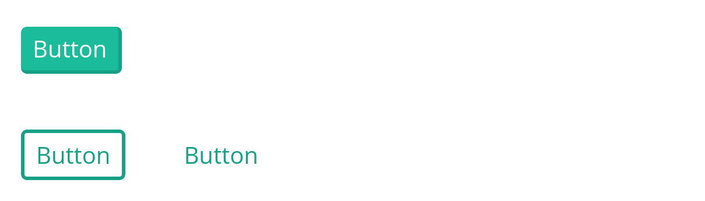
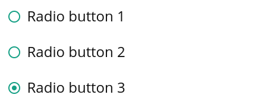
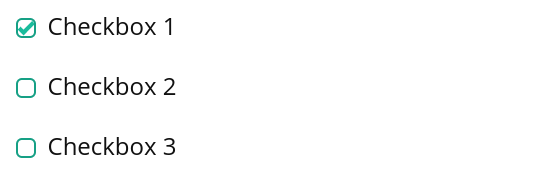
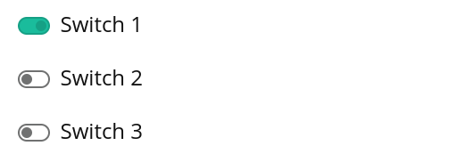

# [](http://uniui.moynihan.io)


[Uniui](http://uniui.moynihan.io) is a React Typescript UI library currently in beta.

## Installation

To install Uniui, simply run the following in the root directory of your react project:

```
    $ npm i react-uniui
```

## Usage

You can import the entire library via:

```ts
    import Uniui from "react-uniui";
```


Or individually:

```ts
    import { Button, Selection } from "react-uniui";
```

## Components Preview
### Buttons

```tsx
<Button>Button</Button>
<Button type="flat">Button</Button>
<Button type="borderless">Button</Button>
```
[See more in the docs](http://uniui.moynihan.io/components/button)

### Radio Menu

```tsx
<SelectionGroup>
  <Selection type="radio" label="Radio button 1" />
  <Selection type="radio" label="Radio button 2" />
  <Selection type="radio" label="Radio button 3" />
</SelectionGroup>
```
### Checkboxes

```tsx
<SelectionGroup>
  <Selection type="checkbox" label="Checkbox 1" />
  <Selection type="checkbox" label="Checkbox 2" />
  <Selection type="checkbox" label="Checkbox 3" />
</SelectionGroup>
```

### Switches

```tsx
<SelectionGroup>
  <Selection type="switch" label="Switch 1" />
  <Selection type="switch" label="Switch 2" />
  <Selection type="switch" label="Switch 3" />
</SelectionGroup>
```

[See more in the docs](http://uniui.moynihan.io/components/selection)

### TextField

```tsx
<TextField value="Text" subtitle="TextField" />
```
[See more in the docs](http://uniui.moynihan.io/components/textfield)

See the [Component API docs](http://uniui.moynihan.io) for further reference
